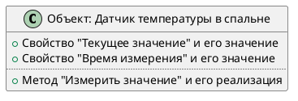
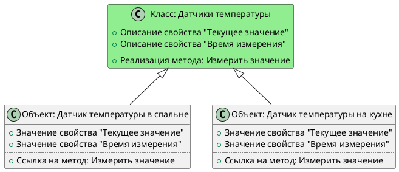
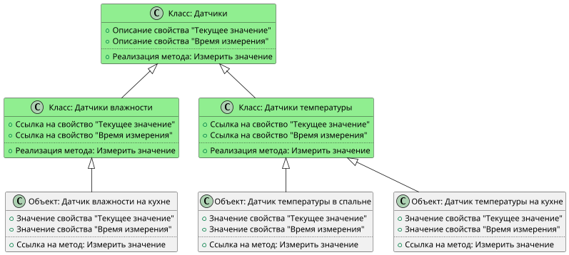

### Теория

Объектная модель -- одна из основных концепций, лежащих в основе платформы MajorDoMo. Понимание этой концепции
позволит максимально полно раскрыть потенциал системы, хоть и не является обязательным для базовой настройки
и использования платформы (см. раздел [Простые устройства]()).

Объектная модель разделяет некоторые принципы ООП (объектно ориентированного программирования), но не является
в буквальном смысле полным его воплощением.

Итак, основной связующей сущностью в системе MajorDoMo является виртуальный **объект**, который для упрощения 
можно представить как некий цифровой двойник устройства/предмета/явления в реальном мире. 

Для примера возьмём *датчик температуры в спальне*.
Каждый объект обладает **свойствами**, т.е. какими-то характеристиками, присущими объекту. В нашем примере это может быть
*текущее значение* и *время измерения*. Кроме того, объекты могут включать в себя определённые действия, которые могут
быть ими (или над ними) проведены -- эти действия называются **методы**. Для нашего примера методом может быть действие
*измерить значение*.

Объекты с общими свойствами и методами объединяются в **классы**. Таким образом, набор свойств и методов можно задать
на уровне класса, а все объекты, относящиеся к заданному классу, станут обладать этими свойствами и будут хранить их
значения. Такая организация позволяет избежать дублирования в описании свойств отдельных объектов и сами объекты
могут хранить лишь значения.

Классы объектов, в свою очередь, могут иметь собственную иерархию, что позволяет объединять их в классы более высокого
уровня. Для примера добавим в наше дерево класс *Датчики влажности* и объединим их вместе с датчиками температуры
в общий "родительский" класс *Датчики*:

Диаграмма выше отображает следующие особенности модели:

- Общие свойства и методы описаны на максимально высоком уровне общности (класса)
- Классы более низкого уровня "наследуют" свойства и методы классов уровней выше
- Реализация метода класса высокого уровня может оперировать свойствами объектов на любом уровне ниже  
- Реализация методов классов может быть различной на разных уровнях

На нашем примере, мы можем вызывать метод *"Датчик температуры в спальне.Измерить значение"* и будет исполнен
код, описанный в реализации метода класса *Датчики температуры*, который, в свою очередь, может задействовать
код метода на уровне класса *Датчики*.

### Практика

Ниже представлены примеры основных экранов Панели управления MajorDoMo, связанных с настройкой классов и объектов.

**Дерево классов/объектов**

(содержимое необходимо доработать)

**Описание класса**

(содержимое необходимо доработать)

**Свойства класса и их параметры**

(содержимое необходимо доработать)

**Методы класса**

(содержимое необходимо доработать)

**Объекты класса**

(содержимое необходимо доработать)